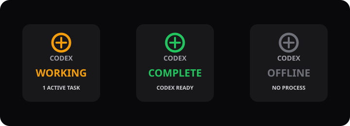

# Codex Status for OpenDeck

[](https://github.com/ChrisTitusTech/streamdeck-dashboard/actions/workflows/ci.yml)
[](https://github.com/ChrisTitusTech/streamdeck-dashboard/releases/latest)
[](LICENSE)

An [OpenDeck](https://github.com/nekename/OpenDeck) plugin for Linux that turns a Stream Deck key into a live Codex task indicator.



| State | Meaning |
| --- | --- |
| Amber **WORKING** | At least one local Codex session has an active task. |
| Green **COMPLETE** | Codex is running and all observed tasks have completed. |
| Gray **OFFLINE** | No local `codex` process is running. |

The key refreshes once per second. Press it to force an immediate refresh.

## Install

Requirements:

- Linux
- [OpenDeck](https://github.com/nekename/OpenDeck) 2.13 or newer
- Node.js 18 or newer installed on the host
- A local Codex client that writes session rollouts under `CODEX_HOME` (normally `~/.codex`)

1. Download the latest `codex-status-v*.streamDeckPlugin` file from [GitHub Releases](https://github.com/ChrisTitusTech/streamdeck-dashboard/releases/latest).
2. Open **OpenDeck > Settings > Plugins**.
3. Choose **Install plugin from file** and select the downloaded file.
4. Find the **Codex** category and drag **Codex Status** onto a key.

OpenDeck's Flatpak build still requires Node.js to be installed natively on the host. See the [complete installation guide](docs/INSTALL.md) for updates, source installs, and troubleshooting.

## How it works

The plugin identifies same-user `codex` processes through Linux `/proc`, follows the exact rollout file each process already has open, and tracks only these lifecycle events:

- `task_started`
- `task_complete`

It does not read or transmit prompt text, responses, credentials, environment variables, or source files. It has no network client other than the local WebSocket connection OpenDeck requires for plugins.

Multiple Codex sessions are supported. If any live session is working, the key remains amber and shows the number of active tasks.

## Scope

This plugin monitors local Linux Codex processes. It does not monitor:

- Codex cloud tasks that have no local process
- Codex running as another operating-system user
- remote Codex sessions on another host
- other coding agents

## Development

```bash
npm install
npm run check
npm test
npm run package
```

The release command creates:

```text
release/codex-status-v1.0.0.streamDeckPlugin
```

For local development installation:

```bash
npm run build
node scripts/install.mjs --slot 0
```

The development installer backs up the selected OpenDeck profile before changing it. Standard users should install the release file through OpenDeck instead.

See [Development](docs/DEVELOPMENT.md) for architecture, validation, packaging, and release details.

## Contributing

Bug reports and pull requests are welcome. Read [CONTRIBUTING.md](CONTRIBUTING.md) and [SECURITY.md](SECURITY.md) before opening an issue involving security-sensitive behavior.

## License

[MIT](LICENSE) - Copyright (c) 2026 Chris Titus Tech.
